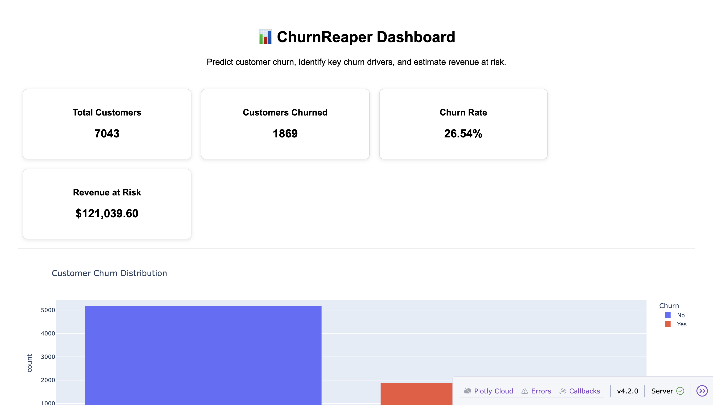
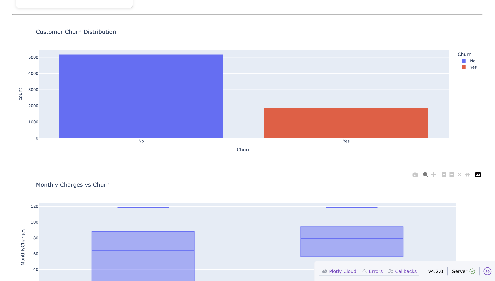
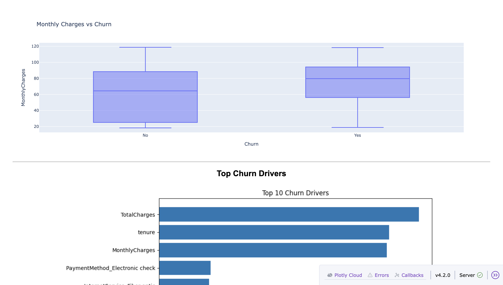
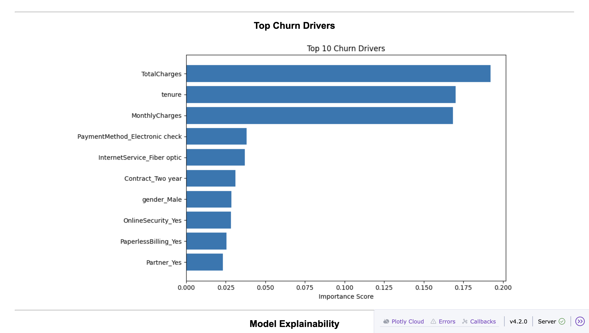
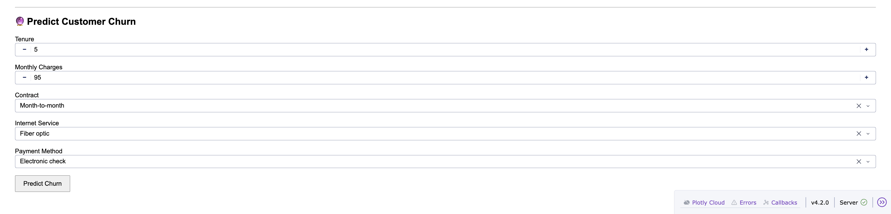
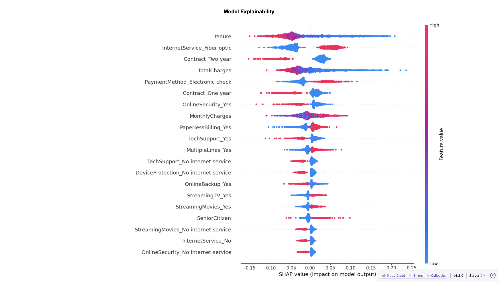

# 📊 ChurnReaper

An Explainable AI-powered Customer Churn Prediction System built using Machine Learning, SHAP Explainability, and Dash.

---

## 🚀 Project Overview

Customer churn is one of the biggest challenges faced by subscription-based businesses.

ChurnReaper predicts whether a customer is likely to leave a telecom company based on customer demographics, billing information, service usage, and contract details.

The project combines:

- Machine Learning Prediction
- Explainable AI (SHAP)
- Interactive Dashboard
- Business Insights

to help organizations identify at-risk customers and reduce customer loss.

---

## 🌐 Live Demo

Coming Soon — AWS deployment will be added in ChurnReaper v2.

---

## 📂 Dataset

Dataset Used:

**Telco Customer Churn Dataset**

Source:
https://www.kaggle.com/datasets/blastchar/telco-customer-churn

Dataset Size:

- 7,043 Customers
- 21 Original Features
- Binary Target Variable (Churn)

Target:

- Yes → Customer left the company
- No → Customer stayed

---

## 🛠 Technologies Used

### Programming Language

- Python

### Data Processing

- Pandas
- NumPy

### Visualization

- Matplotlib
- Seaborn
- Plotly

### Machine Learning

- Scikit-learn
- Random Forest
- Logistic Regression

### Explainable AI

- SHAP

### Dashboard

- Dash

## 🏗 System Architecture

Data Collection
↓
Data Preprocessing
↓
Feature Engineering
↓
Model Training
↓
SHAP Explainability
↓
Dashboard Visualization
↓
Business Insights & Churn Prediction


---

## 📈 Exploratory Data Analysis

The following analyses were performed:

### Customer Churn Distribution

- Churned Customers: ~26%
- Retained Customers: ~74%

### Contract Type vs Churn

Findings:

- Month-to-Month customers had the highest churn rate.
- Two-Year contract customers had the lowest churn rate.

### Monthly Charges vs Churn

Findings:

- Customers with higher monthly charges were more likely to churn.

### Tenure vs Churn

Findings:

- Customers with shorter tenure were more likely to churn.

---

## 🤖 Machine Learning Models

### Logistic Regression

Results:

- Accuracy: ~80.6%
- ROC-AUC: ~84.3%

### Random Forest

Results:

- Accuracy: ~80.4%
- ROC-AUC: ~84.3%

Random Forest was selected for explainability and feature importance analysis.

---

## 🔍 Explainable AI

SHAP (SHapley Additive exPlanations) was used to understand model decisions.

Top churn drivers identified:

1. TotalCharges
2. Tenure
3. MonthlyCharges
4. Electronic Check Payment
5. Fiber Optic Internet
6. Contract Type

These insights help businesses understand why customers are likely to leave.

---

## 📊 Dashboard Features

The interactive dashboard includes:

### Business Metrics

- Total Customers
- Churned Customers
- Churn Rate
- Revenue at Risk

### Visualizations

- Churn Distribution
- Monthly Charges vs Churn
- Feature Importance
- SHAP Explainability

### Prediction Engine

Users can enter:

- Tenure
- Monthly Charges
- Contract Type
- Internet Service
- Payment Method

and receive:

- Churn Prediction
- Churn Probability

---

## 📁 Project Structure

```text
ChurnReaper/
│
├── dashboard/
│   ├── app.py
│   └── assets/
│
├── data/
│   └── WA_Fn-UseC_-Telco-Customer-Churn.csv
│
├── models/
│   ├── churn_model.pkl
│   └── random_forest.pkl
│
├── screenshots/
│
├── src/
│   ├── preprocessing.py
│   ├── train.py
│   ├── random_forest.py
│   ├── feature_importance.py
│   ├── explain.py
│   └── predict.py
│
├── requirements.txt
└── README.md
```

---

## ⚙️ Installation

Clone repository:

```bash
git clone https://github.com/yourusername/ChurnReaper.git
```

Move into project folder:

```bash
cd ChurnReaper
```

Create virtual environment:

```bash
python -m venv venv
```

Activate virtual environment:

### Mac/Linux

```bash
source venv/bin/activate
```

### Windows

```bash
venv\Scripts\activate
```

Install dependencies:

```bash
pip install -r requirements.txt
```

---

## ▶️ Run Dashboard

```bash
python dashboard/app.py
```

Open:

```text
http://127.0.0.1:8050
```

---

## 🎯 Business Impact

ChurnReaper helps organizations:

- Identify customers at risk of leaving
- Understand key churn drivers
- Improve retention strategies
- Reduce revenue loss
- Support data-driven decision making

---

## Dashboard Screenshots

### Main Dashboard


### Churn Distribution


### Customer Analytics


### Feature Importance


### SHAP Explainability


### Churn Prediction



## 🚀 Project Roadmap

### Version 1.0 ✅
- Customer Churn Prediction
- Random Forest Model
- SHAP Explainability
- Interactive Dashboard
- Business Analytics

### Version 2.0 🚧 (In Progress)
- Docker Containerization
- GitHub Actions CI/CD
- AWS Cloud Deployment
- Public Live URL
- Production-Ready Deployment


## 👩‍💻 Author

**Shreya Karamchedu**

MS Computer Science  
California State University, San Bernardino
